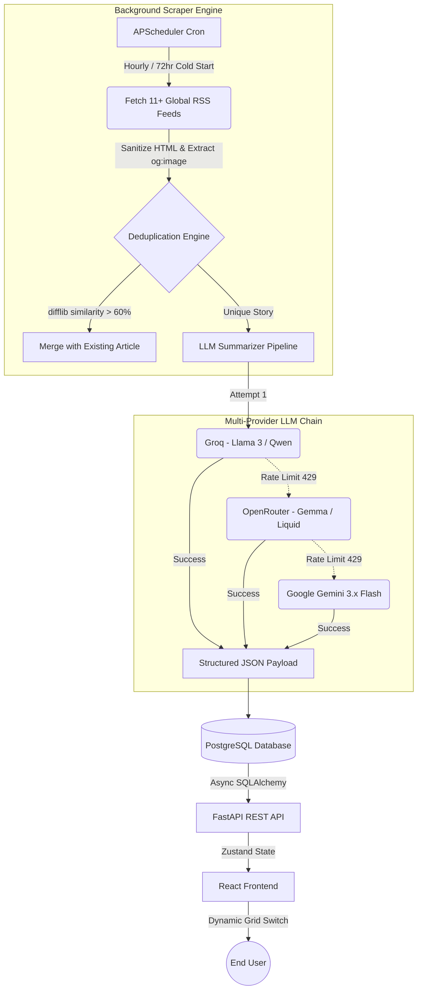

# DigiTak 📈

DigiTak is an intelligent, highly-concurrent automated financial news aggregator. It continuously scrapes, deduplicates, curates, and summarizes top financial stories, IPO news, and crypto updates from around the globe using a resilient multi-provider LLM fallback chain.

---

## 🏗️ Architectural Overview

DigiTak is built for extreme speed and API-limit resilience. It splits the workload between a lightning-fast asynchronous REST API and a heavy-duty background scraper engine.

- **Backend Framework**: [FastAPI](https://fastapi.tiangolo.com/) (Python) running on Uvicorn for asynchronous request handling.
- **Database Engine**: PostgreSQL utilizing `asyncpg` and SQLAlchemy ORM. Optimized with specific B-Tree indexes (`published_at`, `category`, `created_at`).
- **Scraper Engine**: `APScheduler` driven Python cron jobs. Uses `feedparser` and `BeautifulSoup4` to parse and sanitize raw HTML/XML feeds.
- **AI Summarization**: A custom 17-model LLM fallback chain spanning **Groq**, **OpenRouter**, and **Google Gemini** to guarantee a 0% failure rate on summaries despite rigid free-tier rate limits.
- **Frontend App**: React 18 + TypeScript + Vite. State management via `Zustand`. Features a dynamic CSS Grid engine that intelligently shifts between List and Card views based on the presence of parsed OpenGraph image elements.

---

## 🔄 Core Workflow Diagram



---

## 🚀 Key Features

- **72-Hour Cold Start Algorithm**: Upon a fresh server boot with an empty database, the scraper dynamically sets a 72-hour lookback window to populate a massive backlog. On subsequent hourly runs, it automatically shrinks the window to 1-hour to conserve API quotas.
- **Auto-Cleaning Database**: Hooks into the FastAPI `lifespan` context manager to completely wipe the database clean on server restart, avoiding state overlap and guaranteeing fresh feeds.
- **Semantic Deduplication**: Prevents overlapping stories (e.g., CNBC and Yahoo Finance reporting the same IPO) by running a `difflib.SequenceMatcher` across headlines. If a >60% match is found, it appends the secondary source to the primary article instead of duplicating it in the UI.
- **Anti-Vibecode UI Design**: Adheres to strict brutalist design principles: `0px` border radius, system fonts (`Inter`), pure `#F9F9F9` backgrounds, and absolutely no box-shadows or gradients. 

---

## 📂 Codebase Structure

```text
DigiTak/
├── backend/
│   ├── app/
│   │   ├── api/
│   │   │   └── routes.py         # FastAPI REST endpoints
│   │   ├── scraper/
│   │   │   ├── feed_reader.py    # RSS parsing & image extraction
│   │   │   ├── scheduler.py      # APScheduler, Cold Start & Deduplication
│   │   │   └── summarizer.py     # 17-model LLM Fallback Chain
│   │   ├── models.py             # SQLAlchemy Postgres schemas
│   │   └── main.py               # Uvicorn entry point & Lifespan hooks
│   └── alembic/                  # Database migrations
│
└── frontend/
    ├── src/
    │   ├── components/           # Reusable UI (ArticleCard, SearchBar)
    │   ├── pages/                # Views (Home, ArticlePage)
    │   ├── api/                  # Axios HTTP client
    │   └── store/                # Zustand state management
    └── index.html
```

---

## 🔌 External APIs & Feeds Used

1. **Groq API**: Primary LLM inference for generating structural article summaries and extracting categories/tags (utilizing `qwen3.8-27b`, `allam-2-7b`, etc).
2. **OpenRouter API**: Secondary fallback AI layer.
3. **Google Gemini API**: Tertiary fallback AI layer (`gemini-3.8-flash`).
4. **RSS Feeds**: Aggregating raw data from Yahoo Finance, MarketWatch, CNBC, CoinTelegraph, Investing.com, and MoneyControl.
